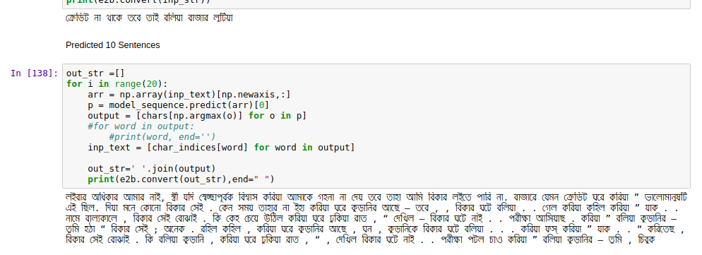

### Bangla Text Generation 
#### MD Muhaimin Rahman
contact: sezan92[at]gmail[dot]com

In this project I am trying to generate some lines from the Short Story of Rabindranath Tagore, named [Shanskar](http://chhotogalpo.com/%e0%a6%b8%e0%a6%82%e0%a6%b8%e0%a7%8d%e0%a6%95%e0%a6%be%e0%a6%b0/) , which is in Bangla. It is a very simple project of Natural Language Processing, which requires Recurrent Neural Network. It will learn the story from the text file. Then It will generate 10 lines from a random sentence from the Story.It is still in primitive stage. Many complex things can be done, I am willing to work on it more in the future God willing . This project is inspired by [this blog](https://machinelearningmastery.com/text-generation-lstm-recurrent-neural-networks-python-keras/). The prediction looks like the given image.

